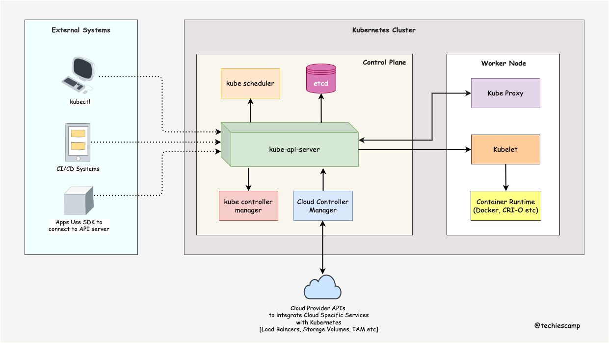

## Hit the Star! :star:

If you are planning to use this repo for reference, please hit the star. Thanks!

## Kubernetes Learning Roadmap

### 1. Prerequisites

- [Learn Container concepts & Gets Hands on with Docker](https://www.freecodecamp.org/news/the-docker-handbook/) Complete Guide
- [Understand Distributed system](https://www.freecodecamp.org/news/a-thorough-introduction-to-distributed-systems-3b91562c9b3c) Blog
- [Understand Authentication & Authorization](https://www.okta.com/identity-101/authentication-vs-authorization/) Blog
- [Learn Basics of Key Value Store](https://redis.com/nosql/key-value-databases/)Blog
- [Learn the basics of REST API](https://blog.postman.com/intro-to-apis-what-is-an-api/)Blog
- [Learn YAML](https://www.educative.io/blog/yaml-tutorial?aff=KNLz)Blog
- [Understand Service Discovery](https://www.nginx.com/blog/service-discovery-in-a-microservices-architecture/) Blog
- Learn Netwoking Basics
   - [L4 & L7 Layers (OSI Layers)](https://www.cloudflare.com/en-gb/learning/ddos/glossary/open-systems-interconnection-model-osi/)Blog
   - [SSL/TLS](https://www.cloudflare.com/en-gb/learning/ssl/how-does-ssl-work/)Blog
   - [Network Proxy Basics](https://stackoverflow.com/questions/224664/whats-the-difference-between-a-proxy-server-and-a-reverse-proxy-server)Blog
   - [DNS](https://www.cloudflare.com/en-gb/learning/dns/what-is-dns/)Blog
   - [IPTables](https://www.youtube.com/watch?v=6Ra17Qpj68c)Video
   - [Software Defined Networking (SDN)](https://www.vmware.com/topics/glossary/content/software-defined-networking.html)Blog

### 2. Learn Kubernetes Architecture

The Following image shows the high level kubernetes architecture and how external services connect to the cluster.

Refer the follwing documents to learn the Kubernetes Architecture.

- [Kubernetes Architecture Explained](https://devopscube.com/kubernetes-architecture-explained/) Blog
- 

### 3. Learn to Setup Kuberntes Cluster

There are many ways to set up a Kubernetes cluster. The following are the recommended ones.

- [Kubernetes the Hard Way](https://github.com/kelseyhightower/kubernetes-the-hard-way)Github
- [Kubeadm Cluster Setup](https://devopscube.com/setup-kubernetes-cluster-kubeadm/)Blog
- [Minikube Development Cluster ](https://devopscube.com/kubernetes-minikube-tutorial/)Blog
- [Kind Development Cluster](https://kind.sigs.k8s.io/)Official Documentation
- [Vagrant Automated Cluster](https://github.com/techiescamp/vagrant-kubeadm-kubernetes)Github

Also, you can use the free cloud credits and set up managed Kubernetes clusters.

- [GKE -Google Cloud $300 free credits](https://cloud.google.com/kubernetes-engine)Website
- [EKS - AWS $300 free POC credits](https://aws.amazon.com/eks/)Website
- [DO Kubernetes - Digital Ocean – $200 free credits](https://devopscube.com/recommends/digital-ocean-sidebar/)Website
- [Linode Kubernetes Engine - Linode Cloud – $100 Free credits](https://devopscube.com/recommends/linode-credits/)Website

### 4. Understand Kubernetes Objects And Resources

<--In Progress-->

### 5. Learn About Pod & Associated Resources

<--In Progress-->

### 6. Learn About Pod Dependent Objects

<--In Progress-->

### 7. Deploy End to End Application on Kubernetes

<--In Progress-->

### 8. Learn About Securing Kubernetes Cluster

<--In Progress-->

### 9. Learn About Kubernetes Operator Pattern

<--In Progress-->

### 10. Learn Important Kubernetes Configurations

<--In Progress-->

### 11. Learn Kubernetes Best Practices

<--In Progress-->

### 12. Learn Kubernetes Logging & Monitoring

<--In Progress-->

### 13. Learn Kubernetes Production Best Practices

- Production Readiness Checklist
- [Learn About 12 Factor Apps](https://12factor.net/) Official Guide
- [Learn From Kubernetes Failure Stories](https://k8s.af/) List of Blogs
- [Scheduling 300,000 Kubernetes Pods in Production Daily](https://www.youtube.com/watch?v=wjy35HfIP_k) Video

### 13. Learn Kubernetes Templating Tools

<--In Progress-->

### 14. Kubernetes Deployment Tools (GitOps Based)

<--In Progress-->
